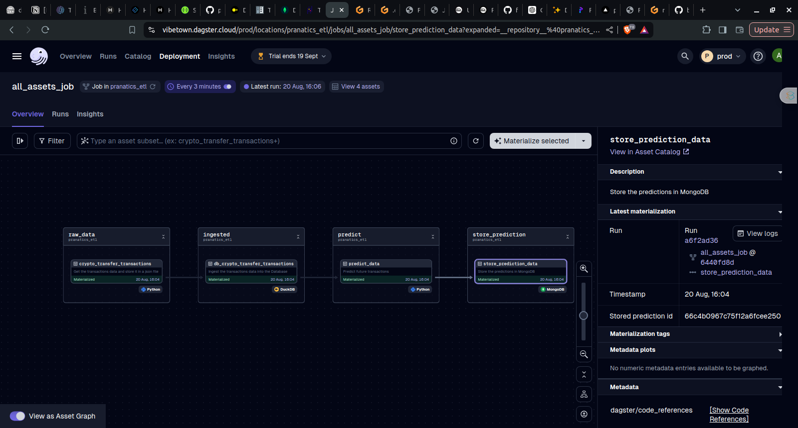
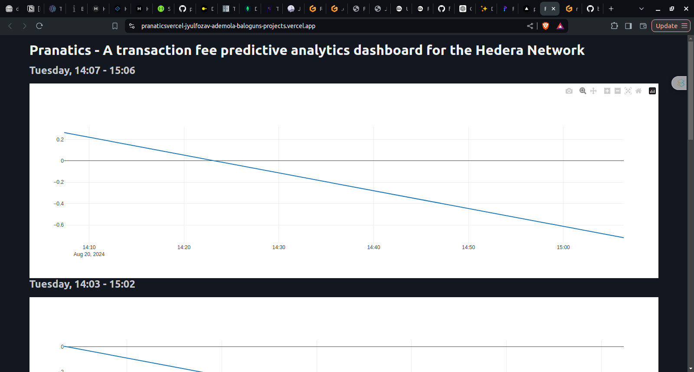

# Pranatics

**Pranatics** is a predictive analytics system designed to forecast the "crypto transfer" transaction fees on the Hedera network. By predicting future transaction costs, Pranatics enables investors and traders to optimize the timing of their transactions, helping them to minimize fees.

[Live Demo](https://pranaticsvercel-jyulfozav-ademola-baloguns-projects.vercel.app/)

## System Overview

Pranatics consists of two main components:

1. **The Pipeline**
   - A data pipeline was developed to ingest transaction data from Hedera mirror nodes, enabling accurate fee predictions. Data is pulled from the mirror node every 3 minutes, which is sufficient given that the maximum number of crypto transfer transactions occurring within that interval is typically under 100.

   

2. **The Dashboard/Frontend**
   - The dashboard visualizes the predictions, presenting them in a user-friendly format with interactive graphs.

   

## Setup Instructions

To get started with Pranatics, follow these steps:

### 1. Clone the Repository

```bash
git clone https://github.com/balojey/pranatics
```

### 2. Set Up the Pipeline

1. Navigate to the pipeline directory:

   ```bash
   cd pranatics/sources/pipeline
   ```

2. Install dependencies using Poetry:

   ```bash
   poetry install
   ```

3. (Optional) Install additional requirements using pip:

   ```bash
   pip install -r requirements.txt
   ```

4. Configure the pipeline:

   ```bash
   cd hedera_pipeline
   cp .example.constants.py constants.py
   ```

   - Open `constants.py` and enter your MongoDB credentials.

5. Start the pipeline:

   ```bash
   dagster dev
   ```

6. Open your browser and navigate to the provided address to interact with the pipeline.

### 3. Set Up the Dashboard

1. Navigate to the frontend directory:

   ```bash
   cd pranatics/sources/frontend
   ```

2. Install dependencies using Poetry:

   ```bash
   poetry install
   ```

3. Configure the environment variables:

   ```bash
   cp .example.env .env
   ```

   - Open `.env` and enter your MongoDB credentials.

4. Run the dashboard:

   ```bash
   poetry run python main.py
   ```

5. Open your browser and navigate to the provided address to view the dashboard.

## Technologies Used

- **Dagster**: For orchestrating the data pipeline.
- **Facebook's Prophet**: For making time-series predictions.
- **FastHTML**: For building the dashboard that serve the predictions.
- **DuckDB**: For storing and querying historical transaction data.
- **MongoDB**: For storing and predictions.

## Contributing

We welcome contributions to Pranatics! If you'd like to contribute, please fork the repository and submit a pull request with your changes.

Thank you.